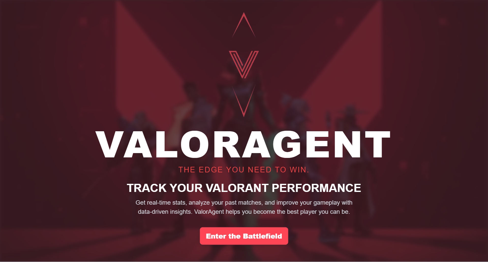

# 🎯 ValorAgent

ValorAgent is a project designed to enhance the gaming experience in *Valorant* by providing data, analytics, and insights. This project aims to create a robust agent that interacts with *Valorant*'s data, offering statistics and analysis to improve performance and strategy. Data is gathered at runtime, ensuring the latest information is available whenever needed.

## 🌟 Features

- **📊 Data Fetching at Runtime**: Data is dynamically retrieved from the API, providing up-to-date information.
- **📈 Analytics and Statistics**: Detailed stats and analysis on player performance, match history, and more.
- **💻 User Interface**: A user-friendly interface for easy interaction and visualization of data.

## 📚 APIs and Documentation

This project utilizes the following APIs:

- **[Henrik Dev API](https://docs.henrikdev.xyz/valorant/general)**: Used for real-time data collection and player statistics.
- **[Valorant API](https://dash.valorant-api.com/)**: Used to retrieve static data related to the game (e.g., agents, weapons, maps).

## 🛠️ Technologies Used

- **⚛️ Next.js**: Framework for building the web application.
- **🔷 TypeScript**: Provides type safety for the codebase.
- **🎨 Framer Motion**: For animations to enhance the UI experience.
- **✨ DaisyUI**: A Tailwind CSS-based UI component library for styling.

## 🤝 Contributing

Contributions are welcome! Please follow these steps:

1. 🍴 Fork the repository.
2. 🌿 Create a new branch (`git checkout -b feature/YourFeature`).
3. 💾 Commit your changes (`git commit -am 'Add new feature'`).
4. 📤 Push to the branch (`git push origin feature/YourFeature`).
5. 📝 Open a Pull Request.

## 📜 License

This project is licensed under the MIT License. See the `LICENSE` file for more information.

## 📬 Contact

For questions or feedback, please contact [Abdallah Benassloune](mailto:benasslounabdallah@gmail.com).
